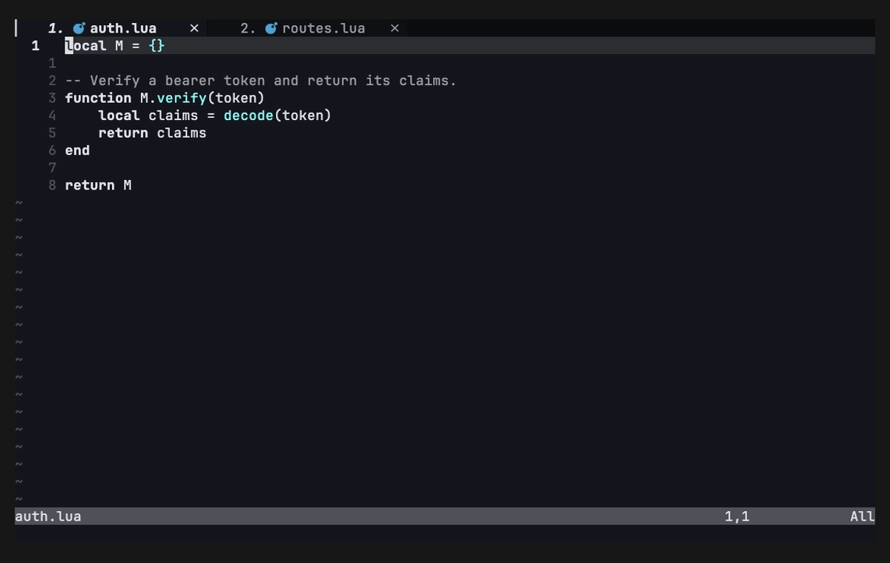

# prompt-reference.nvim

Stage code references — each with its own **prompt** — into a review, then copy
the whole thing to your clipboard formatted for pasting into an LLM.

Instead of copying a snippet, switching to your chat, typing "in `foo.lua` lines
40-52, …", and repeating for every place you want to touch, you build up a
*review*: select some code, jot the instruction for it, repeat across files, and
copy it all at once as one structured message.

## Demo



Select code → type a prompt → repeat → open the review → copy the whole bundle.

## Example output

Selecting two regions and adding a prompt to each, then copying, yields (XML
style):

```xml
<item>
<file path="src/auth.lua" lines="40-52" language="lua">
local function verify(token)
  ...
end
</file>
<prompt>
This doesn't handle expired tokens — add an expiry check.
</prompt>
</item>

<item>
<file path="src/routes.lua" lines="8" language="lua">
router:get("/me", require("auth").verify)
</file>
<prompt>
Make sure this route returns 401 when verify fails.
</prompt>
</item>
```

Or, with `output_style = "markdown"`:

````markdown
src/auth.lua:40-52
```lua
local function verify(token)
  ...
end
```

This doesn't handle expired tokens — add an expiry check.
````

## Install

### lazy.nvim

```lua
{
  "r10a/prompt-reference.nvim",
  -- opt-in default keymaps (see Configuration); omit to bind your own
  opts = { keymaps = true },
}
```

### packer.nvim

```lua
use({
  "r10a/prompt-reference.nvim",
  config = function()
    require("prompt-reference").setup({ keymaps = true })
  end,
})
```

Requires Neovim 0.10+ (uses `vim.fn.getregion`).

## Usage

1. **Select** code in visual mode and **add** it — a prompt window opens; type
   the instruction for that selection and press `<CR>`.
2. Repeat across as many files/regions as you like. A small **review panel**
   appears at the bottom-right showing what's staged.
3. **Open the review**, then press `<CR>` to copy the whole bundle to your
   clipboard and clear it. Paste into your LLM.

### Commands

Always available, no `setup()` required:

| Command | Description |
|---|---|
| `:PromptReferenceAdd` | Add the visual selection (prompts for text) |
| `:PromptReferenceReview` | Open the review window |
| `:PromptReferenceCopy` | Copy the review to the clipboard and clear it |

### In the review window

| Key | Action |
|---|---|
| `<CR>` | Copy the whole review to the clipboard & clear |
| `dd` | Delete the item under the cursor |
| `r` | Re-enter the prompt for the item (shows its code as context) |
| `?` | Show this help |
| `<Tab><Tab>` / `<Esc>` | Close the review |

## Configuration

Defaults:

```lua
require("prompt-reference").setup({
  register = "+",            -- register to copy into (default: system clipboard)
  use_git_root = true,       -- paths relative to the git root; else cwd-relative
  include_code = true,       -- include the selected code, not just the reference
  output_style = "markdown", -- "markdown" or "xml" (xml parses more reliably for Claude)

  -- Opt-in keymaps. `keymaps = true` uses these defaults; a table merges over
  -- them; `false` (the default) binds nothing so you can map the functions yourself.
  keymaps = {
    add = "<CR>",           -- (visual) add selection to the review
    review = "<Tab><Tab>",  -- (normal) open the review
    copy = false,           -- (normal) copy the review without opening it
  },
})
```

To bind your own keys instead of the defaults:

```lua
local pr = require("prompt-reference")
vim.keymap.set("x", "ga", pr.add_selection, { desc = "Add to review" })
vim.keymap.set("n", "gr", pr.review, { desc = "Open review" })
vim.keymap.set("n", "gc", pr.copy_all, { desc = "Copy review" })
```

## API

- `require("prompt-reference").add_selection()` — stage the current visual selection
- `require("prompt-reference").review()` — open the review window
- `require("prompt-reference").copy_all()` — copy the review and clear it

## Development

The demo GIF is generated with [VHS](https://github.com/charmbracelet/vhs)
from `demo/demo.tape`, recorded against the two sample files (`demo/auth.lua`
and `demo/routes.lua`) to show the multi-file review path:

```sh
cd demo
vhs demo.tape          # writes demo/demo.gif
```

The tape sets `FontFamily "JetBrainsMono Nerd Font"` so file-type icons render
(install any Nerd Font and adjust the name to match if you don't have it).

On macOS, if VHS can't reach its headless browser, point it at a real Chrome:

```sh
ROD_BROWSER_BIN="/Applications/Google Chrome.app/Contents/MacOS/Google Chrome" vhs demo.tape
```

## License

MIT
